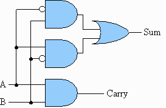

https://judge.beecrowd.com/en/problems/view/1026

# To Carry or not to Carry




$6 + 9 = 15$ seems okay. But how come $4 + 6 = 2$?

You see, Mofiz had worked hard throughout his digital logic course,
but when he was asked to implement a 32 bit adder for the laboratory
exam, he did some mistake in the design part. After tracing the design
for half an hour, he found his flaw!! He was doing bitwise addition but
his carry bit always had zero output. Thus,

```
4  = 00000000 00000000 00000000 00000100
+6 = 00000000 00000000 00000000 00000110
----------------------------------------
2  = 00000000 00000000 00000000 00000010
```

It’s a good thing that he finally found his mistake, but it was too late.
Considering his effort throughout the course, the instructor gave him one
more chance. Mofiz has to write an efficient program that would take 2
unsigned 32 bit decimal numbers as input, and produce an unsigned 32 bit
decimal number as the output adding in the same way as his circuit does.

## Input

In each line of input there will be a pair of integer separated by a single
space. Input ends at EOF.

## Output

For each line of input, output one line: the value after adding the two
numbers in the "Mofiz way".
