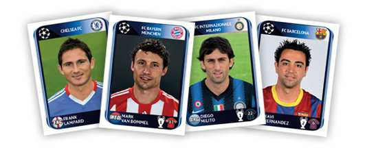

http://www.beecrowd.com.br/judge/en/problems/view/1028

# Collectable Cards

Richard and Vicent are crazy about football collectable cards. In his
spare time they're up a way to play some game involving such cards.
Both also have the habit of exchanging the repeated cards with their
friends and one day they thought about a different game. They called all
their friends and proposed the following. With the cards in hand, each
one tried to make an exchange with his closest friend following this simple
rule: each one must count how many cards he owned and after he had to split
these cards into stacks, all of it with the same size, as large as it was
possible for both players. So then each one choose one of the friend card
stacks to receive. For example, if Ricardo and Vicente would change the figures
with respectively 8 and 12 figures each, both must put his cards in stacks of
four cards (Ricardo would have two stacks and Vincent had three stacks), and
both choose a stack from his friend to receive it.

## Input

The first line of the input contains a single integer $N (1 \leq N \leq 3000)$,
indicating the number of test cases. Each test case contains two integer
numbers $F1 (1 \leq F1 \leq 1000)$ and $F2 (1 \leq F2 \leq 1000)$
indicating, respectly, the among of collectable cards that Richard and
Vicent have to change.

## Output

For each test case there will be an integer number at the output, representing
the maximum size of the stack of cards which can be exchanged between two
players.
