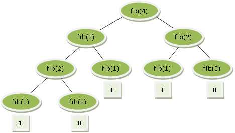

http://www.beecrowd.com.br/judge/problems/view/1029

# Fibonacci, How Many Calls?

Sometimes when you are a Computer Science student, you’ll see a
exercise or problem involving the Fibonacci sequence. This sequence
has the first two values 0 (zero) and 1 (one) and each next value
will always be the sum of the two preceding numbers. By definition,
the formula to find any Fibonacci number is:

```
fib(0) = 0
fib(1) = 1
fib(n) = fib(n - 1) + fib(n - 2);
```

One way of finding Fibonacci numbers is by recursive calls. This is
illustrated below, presenting the derivation tree when we calculate
fib(4), i.e. the fifth value of this sequence:



In this way,
fib(4) = 1+0+1+1+0 = 3
8 recursive calls were done.

## Input

The first line of the input contains a single integer $N$, indicating the
number of test cases. Each test case contains an integer number $X
(1 \leq X \leq 39)$.

## Output

For each test case we will have a line of output, in the following format:
fib(n) = x calls = y, always with a space before and after the equal sign,
as shown below.
