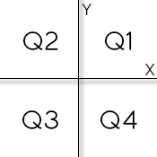

http://www.beecrowd.com.br/judge/problems/view/1041

# Coordinates of a Point

Write an algorithm that reads two floating values (x and y), which should
represent the coordinates of a point in a plane. Next, determine which
quadrant the point belongs, or if you are over one of the Cartesian axes or
the origin (x = y = 0).

If the point is at the origin, write the message "Origem". If the point is
over X axis write "Eixo X", else if the point is over Y axis write "Eixo Y".

## Input

The input contains the coordinates of a point.

## Output

The output should display the quadrant in which the point is.
