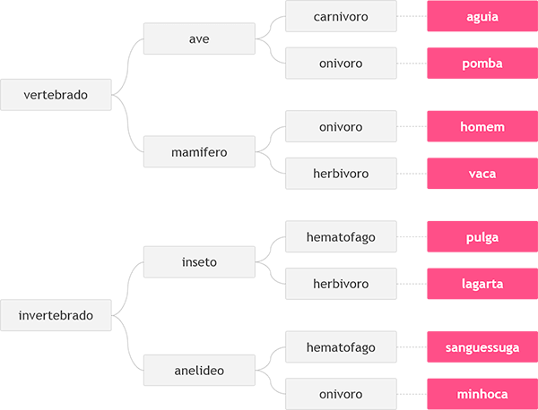

http://www.beecrowd.com.br/judge/problems/view/1049

# Animal

In this problem, your job is to read three Portuguese words. These words
define an animal according to the table below, from left to right. After,
print the chosen animal defined by these three words.

## Input

The input contains 3 words, one by line, that will be used to identify
the animal, according to the above table, with all letters in lowercase.

## Output

Print the animal name according to the given input.
