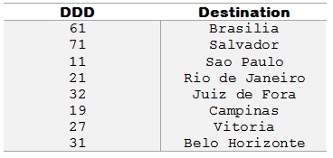

http://www.beecrowd.com.br/judge/problems/view/1050

# DDD

Read an integer number that is the code number for phone dialing. Then, print
the destination according to the following table:

If the input number isn’t found in the above table, the output must be: DDD
nao cadastrado That means “DDD not found” in Portuguese language.

## Input

The input consists in a unique integer number.

## Output

Print the city name corresponding to the input DDD. Print DDD nao cadastrado
if doesn't exist corresponding DDD to the typed number.
