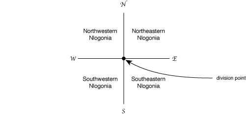

https://judge.beecrowd.com/en/problems/view/1091

# Division of Nlogonia

After centuries of hostilities and skirmishes between the four nations
living in the land generally known as Nlogonia, and years of negotiations
involving diplomats, politicians and the armed forces of all interested
parties, with mediation by UN, NATO, G7 and SBC, it was at last agreed by
all the way to end the dispute, dividing the land into four independent
territories.

It was agreed that one point, called division point, with coordinates
established in the negotiations, would define the country division, in the
following way. Two lines, both containing the division point, one in the
North-South direction and one in the East-West direction, would be drawn on
the map, dividing the land into four new countries. Starting from the
Western-most, Northern-most quadrant, in clockwise direction, the new
countries will be called Northwestern Nlogonia, Northeastern Nlogonia,
Southeastern Nlogonia and Southwestern Nlogonia.

The UN determined that a page in the Internet should exist so that the
inhabitants could check in which of the countries their homes are. You
have been hired to help implementing the system.

## Input

The input contains several test cases. The first line of a test case contains
one integer $K$ indicating the number of queries that will be made
$(0 \lt K \leq 10^3)$. The second line of a test case contains two integers $N$
and $M$ representing the coordinates of the division point
$(-10^4 \lt N, M \lt 10^4)$. Each of the K following lines contains two integers
$X$ and $Y$ representing the coordinates of a residence
$(-10^4 \leq X, Y \leq 10^4)$.

The end of input is indicated by a line containing only the number zero.

## Output

For each test case in the input your program must print one line containing:

- the word divisa (means border in Portuguese) if the residence is on one of the
border lines (North-South or East-West);
- NO (means NW in Portuguese) if the residence is in Northwestern Nlogonia;
- NE if the residence is in Northeastern Nlogonia;
- SE if the residence is in Southeastern Nlogonia;
- SO (means SW in Portuguese) if the residence is in Southwestern Nlogonia.

