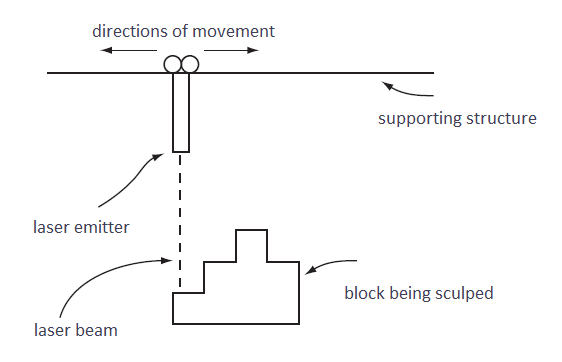
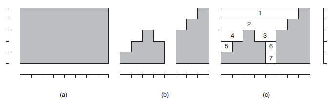

https://judge.beecrowd.com/en/problems/view/1107

# Laser Sculpture

Since its invention, in 1958, the laser has been used in a huge variety of
applications, like electronic equipment, cirurgical instruments, weapons, and
much more.

The image above shows a diagram of an equipment to sculpt, with a laser, a block
of some solid material. In the figure we can see a laser emitter that moves
horizontally to the right and left with a constant speed. When the emitter is
turned on when moving, a specific width layer is removed from the block, being
vaporized by the laser.

The image below illustrates the process of sculpting with a laser, showing an
example of (a) a block, with a height of 5 mm and a length of 8 mm, at the start
of the process, (b) the format that we want the sculpted block to be, and (c)
the sequence of layer removals during the process, considering that in each
step, a layer with 1 mm of width is removed. In the first step, the piece
numbered 1 is removed; in the second, the one numbered with 2; and so it goes
on. During the process of sculpting, the laser was turned on 7 times, in total,
once for each removed piece of the block.

Write a program that, given the height and the length of the block, and its
final format, find out the total number of times the laser must be turned on.

## Input

The input contains several test cases. Each test case is composed by two lines.
The first line of a test case contains two integers $A$ and $C$, separated by a
blank space, indicating, respectively, the height ($1 \leq A \leq 10^4$)$ and
the length ($1 \leq C \leq 10^4$) of the block to be sculpted, in milimeters.
The second line contains $C$ integers $X_i$, each one indicating the final
height, in milimeters of the block between the positions $i$ and $i + 1$ through
the length ($0 \leq X_i \leq A$, for $0 \leq i \leq C - 1$). Consider that on
each step, a layer of width 1 mm is removed on the parts of the block where the
laser is turned on.

The end of the input is indicated by a line that contains only two zeros,
separated by a blank space.

## Output

For each test case, your program must print a single line, containing an
integer, indicating the number of times that the laser must be turned on to
sculpt the block in the indicated format.
