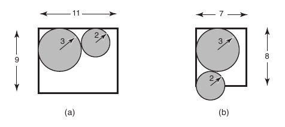

https://www.beecrowd.com.br/judge/en/problems/view/1124

# Elevator

The FCC (Factory of Cylinders of Carbon) manufactures various types of
cylinders of carbon. FCC is installed on the tenth floor of a building, and
uses the several building's elevators to transport the cylinders. For
security, the cylinders must be transported in the upright position, and since
they are heavy, at most two cylinders can be transported in a single elevator
ride. The elevators have the shape of a parallelepiped and their height is
always greater than the height of the cylinders.

To minimize the number of elevator trips to transport the cylinders, the FCC
wants, whenever possible, to put two cylinders in the elevator. The figure
below illustrates, schematically (top view) a case where this is possible (a),
and a case where this is not possible (b):

As there is a very large amount of elevators and types of cylinders, FCC hired
you to write a program that, given the dimensions of the elevator and of the
two cylinders, determines whether it is possible to put the two cylinders in
the elevator.

## Input

The input contains several test cases. The first and only line of each test
case contains four integers $L$, $C$, $R1$ e $R2$, separated by blanks,
indicating the width $(1 \leq L \leq 100)$ and the length $(1 \leq C \leq
100)$ of the elevator and the radius of the cylinders $(1 \leq R1, R2 \leq
100)$.

The last test case is followed by a line containing four zeros separated by
blanks.

## Output

For each test case your program should print a single line with a single
character, 'S' if you can put the two cylinders in the elevator and áN'
otherwise.

