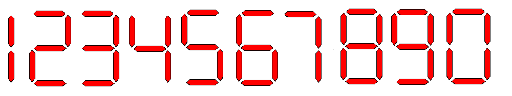

http://www.beecrowd.com.br/judge/problems/view/1168

# LED

John wants to set up a panel containing different numbers of LEDs. He does not
have many leds, he is not sure if will be able to mount the desired number.
Considering the configuration of the LEDs of the numbers below, make an
algorithm that helps John to discover the number of LEDs needed to set the
value.

## Input

The input contains an integer $N, (1 \leq N \leq 2000)$ corresponding to the
number of test cases, followed by $N$ lines, each line containing an number
$(1 \leq V \leq 10^100)$ corresponding to the value that John wants to set
with the leds.

## Output

For each test case, print one line containing the number of LEDs that John
needs to set the desired value, followed by the word "leds".
