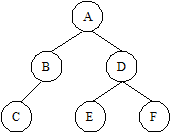

https://judge.beecrowd.com/en/problems/view/1194

# Pre, In and Post

A common problem in data structures is to determine the traversal of a binary
tree.

There are three classic ways to do it:

 - Pre-order: You must visit in sequence the root, left subtree and the right
   subtree.
 - In-order: You must visit in sequence the left subtree, the root and the
   right subtree.
 - Post-order: You must visit in sequence the left subtree, the right subtree
   and the root.

See the picture below:

The pre, in and post-order traversal are, respectively,  ABCDEF, CBAEDF and
CBEFDA. In this problem, you must compute the post-order traversal of a binary
tree given its in-order and pre-order traversals.

## Input

The input set consists of a positive number $C \leq 2000$, that gives the
number of test cases and $C$ lines, one for each test case. Each test case
starts with a number $1 \leq N \leq 52$, the number of nodes in this binary
tree. After, there will be two strings $S1$ and $S2$ that describe the
pre-order and in-order traversal of the tree. The nodes of the tree are
labeled with different characters in the range a..z and A..Z. The values of
$N$, $S1$ and $S2$ are separeted by a blank space.

## Output

For each input set, you should output a line containing the post-order
transversal for the current tree.
