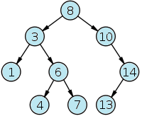

https://www.beecrowd.com.br/judge/en/problems/view/1195

# Binary Search Tree

In computer science, a binary search tree (BST), which may sometimes also be
called an ordered or sorted binary tree, is a node-based binary tree data
structure which has the following properties:

The left subtree of a node contains only nodes with keys less than the node's
key. The right subtree of a node contains only nodes with keys greater than or
equal to the node's key. Both the left and right subtrees must also be binary
search trees. The major advantage of binary search trees over other data
structures is that the related sorting algorithms and search algorithms such
as in-order traversal can be very efficient.

For this problem, you will receive many set of numbers and from each set you
must to build the BST equivalent. For example, an imput with the sequence of
numbers: $8$ $3$ $10$ $14$ $6$ $4$ $13$ $7$ $1$ will result in the following
binary search tree:

## Input

The input file contains many test cases. The first line of input contains an
integer $C (C \leq 1000)$, indicating the number of test cases that follow.
Each test case contains two lines. The first line contains a number $N (1 \leq
N \leq 500)$ indicating the amount of numbers that will form each one of the
trees. The second line contains the $N$ distinct non-negative numbers, each
one separated by a space.

## Output

For each input set, you should print the message "Case n:", where n is the
sequential test case number, followed by 3 lines with the pre-order, in-order,
post-order transversal for the current tree formatted according to the given
example.

Note: None space must be printed after the last number of each line and the
program should print a blank line after each test case, even after the last
test case.
