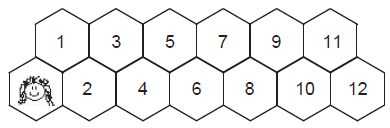

https://judge.beecrowd.com/en/problems/view/1393

# Hexagonal Tiles

The path to Mary's school is a straight line paved with hexagonal tiles. The
picture below shows an example of the path with 12 numbered tiles.

​

Mary loves mathematics. When going to school, she steps on the tiles of that
path following these rules:

She always starts from the tile with the smiling face (as nothing matches
starting anything with a smile!). This tile is always present at the beginning
of the path. The other tiles are numbered consecutively, in ascending order,
starting from 1, as shown in the figure. She is not allowed to go back, that is,
she must not step on a tile which bears a lower number than the tile she is on
(when decided to go to school, there she goes!). She always steps from a tile to
a neighboring one (no jumps in order to keep out of harm's way!). She must
always finish on the highest numbered tile. When classes are over, she is so
tired that she avoids the path and walks on the lawn. Mary does not want to
repeat any sequence of steps on the tiles and she would like to know, if the
path is paved with N numbered tiles and a tile with the face, how many days will
it take to make each possible sequence once.

For example, five days will be needed for her to try all possible step sequences
if the path has $N = 4$ tiles, one day for each of the sequences: 1-2-3-4,
1-2-4, 1-3-4, 2-3-4 and 2-4. Write a program to determine how many different
step sequences there are for a path with a given number $N$ of tiles.

## Input

The input contains several test cases. Each test case is composed by a line
containing an integer $N (1 \leq N \leq 40)$, the number of tiles in the path.
The last test case is followed by a line containing a single zero.

## Output

For each test case, print a line containing a single integer, the number of
different step sequences.
