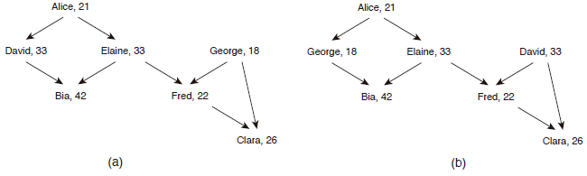

https://www.beecrowd.com.br/judge/en/problems/view/1469

# Boss

Everyone knows Iks, the last trend in social network, which made so much
success that competitors like Facebook and Google+ are strugling to keep their
own social networks in business. As several “.com” companies, Iks started in a
small garage, but today employs hundreds of thousands. Iks has also a
non-standard management system. For example, there are no committees or
boards, which means less time spent on internal meetings. However, as usual in
other companies, there is a chain (or rather several chains) of command, as a
person may manage other emp loyees, and may be managed by other employees. The
figure below shows the chain of comman d for some employees, along with their
ages.

A person P1 may manage another person P2 directly (when P1 is the immediate
superior of P2 ) or indirectly (when P1 manages direclty a person P3 who
manages P2 directly or indirectly). For example, in the figure above, Alice
manages David directly and Claire in directly. A person does not manage
himself/herself, either directly or indirectly. One folklore that developed in
Wall Street is that Iks is so successfull because in its chain of command a
manager is always younger than the managed employee. As we can see in figure
above, that is not true. But this folklore prompted Iks to develop a tool to
st udy its own management system, and to understand whether age plays a role
in its success. You have be en hired to work on that tool. Given the
description of the chain of command at Iks and the ages of its employees,
write a program that answers a series of instructions. Instructions are of two
types : management change and query. An instruction of management change swaps
the positions of two employees A and B . As an example, figure (b) above shows
the resulting chain of command when David and Ge orge change their respective
positions in the chain of command. A query instruction names one employee A
and asks the age of the youngest manager of A ; that is, the youngest person
in the chain of command at Iks that manages A , either directly or indirectly.
For example, in figure (a) above the youngest manager of Clara is 18 years
old; in figure (b), the youngest manager of Clara is 21 years old.

## Input

The input contains several test cases and ends with EOF. Each test case is
described using several lines. The first line of a test case contains three
integers $N (1 \leq N \leq 500)$, $M (0 \leq M \leq 60 \times 10^3)$ and $I (1 \leq I \leq 500)$ , representing respectively the number of employees, the
number of direct manage relations and the number of instructions. Employees
are identified by numbers from 1 to $N$. The second line contains $N$ integers
$K_i (1 \leq Ki \leq 100, \space for \space 1 \leq i \leq N)$, where $K_i$
indicates the age of the employee number $i$.

Each of the following $M$ lines contains two integers $X$ and $Y (1 \leq X, Y
\leq N, X \neq Y)$, indicating that $X$ manages $Y$ directly. Then it follows
$I$ lines, each describing an instruction. An instruction of type managem ent
change is described by a line containing the identifier $T$ followed by two
integers $A$ and $B (1 \leq A, B \leq N)$, indicating the two employers that
must swap places in the chain of command. An instruction of type query is
described by a line containing the identifier $P$ followed by one integer $E
(1 \leq E \leq N)$, representing the number of an employer. The last
instruction is of type query.

## Output

For each instruction of type query your program must print a single line
containing a single integer, the age of the employee who is the youngest
person that manages the employ er named in the query (directly or indirectly),
if that person exists. If the employe e does not have a manager, print an '*'
(asterisc).
