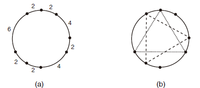

http://www.beecrowd.com.br/judge/en/problems/view/1472

# Triangles

You will be given N points on a circle. You must write a program to determine
how many distinct equilateral triangles can be constructed using the given
points as vertices.

The figure below illustrates an example: (a) shows a set of points, determined
by the lengths of the circular arcs that have adjacent points as extremes; and
(b) shows the two triangles which can be built with these points.

## Input

The input contains several test cases and ends with EOF. The first line of a
test case contains an integer $N$ ($3 \leq N \leq 10^5$), the number of points
given. The second line contains N integers $X_i$ ($1 \leq Xi \leq 10^3$) for
$1 \leq i \leq N$, representing the lengths of the circular arcs between two
consecutive points in the circle: for $1 \leq i \leq (N − 1)$, $X_i$
represents the length of the arc between between points i and $i + 1$; $X_N$
represents the length of the arc between points $N$ and 1.

# Output

For each test case your program must output a single line, containing a single
integer, the number of distinct equilateral triangles that can be constructed
using the given points as vertices.
