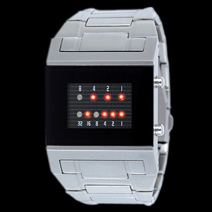

https://www.beecrowd.com.br/judge/en/problems/view/1561

# Binary Watch

Some programmers like to be weird and use \leqes like this one in the picture
below:

There are also programmers who like to create questions for online
competitions, but don't like to write long and detailed texts in the
questions.

Your task in this problem is to draw the clock image at a given time.

## Input

The input consists of several test cases. Each test case consists of one line
containing a time in the format HH:MM ($0 \leq HH < 12$ e $0 \leq MM < 60$).

## Output

For each test, the output consists of a clock picture in the time given at the
input (the picture should match exactly the format in the examples). Print a
blank line after each picture.
