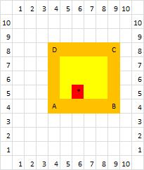

https://judge.beecrowd.com/en/problems/view/1618

# Colision

You have been tasked to check if the robot invaded a rectangular area formed by
four cardinal points ($A$, $B$, $C$ and $D$). Will be informed the four cardinal
points of a plan as shown. The area is formed by connecting the four points as
follows $AB$, $BC$, $CD$ and $DA$. The $X$, $Y$ coordinate of the robot will be
informed

## Input

The input consists of several test cases. The first line is formed by a number
$N$ indicating the total number of test cases. The next $N$ lines consist of 10
integers ($A_x$, $A_y$, $B_x$, $B_y$, $C_x$, $C_y$, $D_x$, $D_y$, $R_X$, $R_Y$)
representing each of the vertices $A$, $B$, $C$ and $D$ and the location $X$,
$Y$ robot. Each value is separated by a blank space.

## Output

The output should print for each test case, the number 1 if the robot is within
the area (considering the edges of the figure as part of the area of the figure)
, and print the number 0 otherwise.

