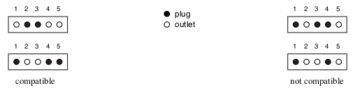

https://www.beecrowd.com.br/judge/en/problems/view/1743

# Automated Checking Machine

The Internet Computer Parts Company (ICPC) is an on-line shop that sells
computer parts. Pairs of in-line electrical connectors are among the most
popular parts that ICPC sells. However, they are also one of the parts that
are returned more often by unsatisfied customers, because due to errors in
packaging the connectors sent to the costumers may not be compatible.

An in-line connector is composed of five connection points, labelled from 1
to 5. Each connection point of a connector can be either a plug or an outlet.
We say two connectors are compatible if, for every label, one connection point
is a plug and the other connection point is an outlet (in other words, two
connectors are compatible if, for every connection point with the same label,
a plug and an outlet meet when the two connectors are connected).

The figure below shows examples of two connectors that are compatible and two
connectors that are not compatible.

ICPC is introducing a state-of-the-art Automated Checking Machine (ACM), with
an optical checker, which will verify whether the two connectors packaged for
a customer are indeed compatible. The com- plex and expensive hardware of the
ACM is ready, but they need your help to finish the software.

Given the descriptions of a pair of in-line connectors, your task is to
determine if the connectors are compatible.

## Input

The first line contains five integers $X_i$ ($0 \leq Xi \leq 1$ for
$i = 1, 2, ..., 5$), representing the connection points of the first connector
in the pair. The second line contains five integers $Y_i$
($0 \leq Yi \leq 1$ for $i = 1, 2, ..., 5$), representing the connection
points of the second connector. In the input, a 0 represents an outlet an a 1
represents a plug.

## Output

Output a line with a character representing whether the connectors are
compatible or not. If they are compatible write the uppercase letter “Y”;
otherwise write the uppercase letter “N”.
