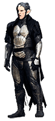

https://judge.beecrowd.com/en/problems/view/1766

# The Dark Elf

The stable where the reindeers were was intentionally opened by the Dark Elf
allowing each of them to run and fly freely around the Santa Claus' factory,
causing the greatest disorder. The elves are desperately trying to do everything
possible to let the sled ready for departure. You are responsible for putting
each reindeer in its correct position so that it is captured by one of the other
elves.

You know the stable follows an organization based on the order that the
reindeers will occupy the sled. Thus, at the time of departure all of them can
be easily positioned. Unlike what you may think, the reindeers are placed in a
single queue ahead in the sled. Not all reindeers in the stable are used on each
trip, that depends on the total load of the sled.

You got the list with all the characteristics that are used to determine the
reindeer order. They must first be sorted by the descending order of weight. If
two or more have the same weight they should be sorted in ascending order by age
and height, if the tie still remains, order by name.

Using your last generation magical computer you want to write a program to order
the reindeers according to informed characteristics and display only the exact
number of reindeers that will be used by the sled (in an orderly manner).

## Input

This problem has several test cases. The first line of the input contains an
integer $T (1 \leq T \leq 10^5)$ that indicates the number of test cases that
follows. The first line of each test case contains two integers $N$ and $M (5
\leq N, M \leq 10^3)$ respectively indicating the total number of reindeers and
the number of reindeers that will pull the sleigh. In the next lines it will be
informed an string $S$ followed by two integers $W (1 \leq W \leq 300)$ and $A
(1 \leq A \leq 300)$ and a floating point number $H (0.00 \leq H \leq 3.00)$,
indicating the name, weight, age and height of each raindeer.

## Output

For each test case you should print the message "CENARIO {i}" where i indicates
the current test case followed by the position and the name of each of the $M$
reindeer that will pull the sleigh, ordered as described above.
