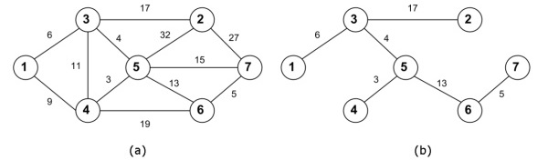

https://judge.beecrowd.com/en/problems/view/1774

# Routers

Bruno is responsible for configuring the routers of a company. Routers transmit
data to each other through the internet cables, the transmitted data can travel
by one or more routes for reach the receiver.

The price of network cables used in the company's routers can be very expensive,
and the company needs to save money. Thinking about that, the company decided to
make some changes in the network infrastructure.

Bruno must modify the network infrastructure and make sure that all routers are
able to transmit data to each other and there is only one route between each
pair of routers, saving as much as possible of internet cables.

You have to find out the total cost with cables that the company will have after
the changes made by Bruno. The figure below shows (a) the current infrastructure
networks; and (b) the infrastructure networks after the change.

## Input

The first line contains two integers $R (3 \leq R \leq 60)$ and $C (R \leq C
\leq 200)$ representing respectively the number of routers and the number of
internet cables.

Followed by $C$ lines, each one containing three integers $V (1 \leq V \leq R)$,
$W (1 \leq W \leq R)$ and $P (1 \leq P \leq 10000)$. $V$ and $W$ representing a
pair of routers that are connected to each other through the internet cable and
$P$ representing the price of the cable.

## Output

Your program should print one integer value representing the total cost that the
company will spend with cables after the modifications.
