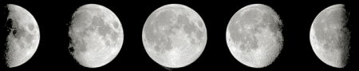

https://www.beecrowd.com.br/judge/en/problems/view/1893

# Moon Phases

Jade won as birthday gift a telescope and is very happy, because she loves
stay looking the moon at night. She was always a very good student, and just
analyzing the moon for two consecutive nights, she can already identify the
changes that occurred in lighting and the approximate percentage of the moon
that are illuminated.

You, who is a Jade's friend and a Computer Science student, decided to make a
small program that, based on her analise made in the last two nights, informs
the phase in which the moon is. If the visible portion of the moon is between
0 and 2%, for example, is new moon ("nova" in portuguese). If it is between 3
and 96% is crescent moon ("crescente" in portuguese), if it is between 97 and
100% is full moon ("cheia" in portuguese) and it is between 3 and 96 %
(decreasing) is waning moon ("minguante" in portuguese).

## Input

The input consists of a single line containing two integer numbers. The first
number corresponds to the percentage observed by Jade at night two days ago.
The second value corresponds to the percentage observed by jade the night
before.

## Output

Based on the two percentage observed by Jade, print on the screen at what
stage the moon was in the night before. Don't forget the end-of-line character
:)
