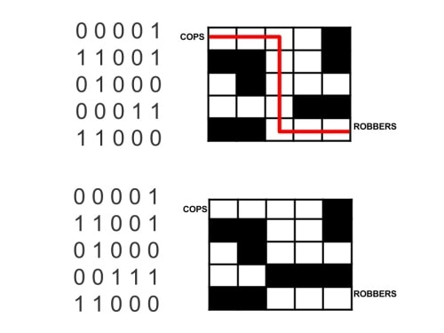

https://judge.beecrowd.com/en/problems/view/1905

# Cops and Robbers

Mario always invites his friends to play in his home. This time he decided to
invite his friends to play Cops and Robbers.

The game consists of two groups, the cops and the robbers. The robbers are
hiding themselves and the cops must catch them. If the cops catch the robbers,
they'll win the game. Otherwise the robbers will. Mario joined the cops group
and have to catch the robbers.

The robbers group felt disadvantages because they don't have strategic places to
hide in the yard.

So they decided to create a maze with cardboard boxes, so they can let the cops
locked in the maze and win the game. The walls of the maze are labeled as '0'
and '1'. where '0' represents the walls that the cops can walk through it and
'1' the walls that are locked

The robbers will always hide themselves in the last slot of the labyrinth, if
the cops get trapped in the maze, the robbers can escape and win the game, but
if the cops group catch the robbers, the cops will win the game. Your task is to
find out from the maze who will win the game.

## Input

The first line contains an integer number $T (1 \leq T \leq 400)$ representing
the number of test cases.

The next $T$ lines consists if a $5 \times 5$ matrix, composed of integers
values being 0 or 1.

## Output

Your program should print "COPS" if the Cops are the winners and "ROBBERS" in
case the Robbers are the winners.
