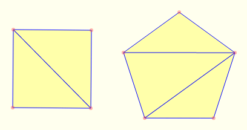

https://www.beecrowd.com.br/judge/en/problems/view/2058

# Triangles and Regular Polygons

Professor Rafael loves Computer Graphics. Its favourite activity is rendering
objects, specially dolls. But he does not like to draw regular polygons using
triangles. This task is done by composing a regular polygon using only
triangles, in such a way that the triangles do not intercept each other and
the minimum number of them are used in this composition. In the picture below
you can see a square and a pentagon with its triangles.

Professor Rafael asked you to calculate the minimum number of triangles
necessary to compose a N-sided regular polygon.

## Input

The input is a single number $N$ ($3 \leq N \leq 10^9$), indicating the number
of sides of a regular polygon.

## Output

The output is the minimum number of triangles necessary to compose an N-sided
regular polygon.
