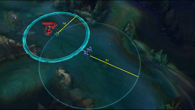

https://judge.beecrowd.com/en/problems/view/2203

# Crowstorm

Fiddlesticks is a champion of League of Legends, he has as his ultimate ability
"CrowStorm", it works as follows:

First Fiddlesticks chooses a strategic location and promptly he prepares to
resurface in one direction within a certain distance, then it is rooted and
channels the ultimate by just 1.5 seconds, after that time it resurfaces
immediately at the target site with a flock of crows flying in the around and
causing much damage.

Fiddlesticks want your help to find out if in a certain position it is possible
to achieve an invader with his ultimate skill.

Note: Consider that Fiddlesticks always uses his ultimate exactly in the
direction of ivasor and the invader always tries to flee in the opposite
direction to Fiddlesticks, at a constant speed.

## Input

The entry consists of several lines, each line contains the following integer
values: $X_f$, $Y_f$, $X_i$, $Y_i$, $V_i$, $R_1$ e $R_2(0 \leq X_f, Y_f, X_i,
Y_i, V_i, R_1$ e $R_2 \leq 100)$, representing respectively the coordinates of
Fiddlesticks, the initial coordinates of the invader, the speed of the invader,
the ultimate of casting radius and flight radius of crows. Consider the unit of
measurement as the meter.

## Output

In the output you should print for each line the 'Y' character if it is possible
to achieve the invasor or 'N' otherwise, both followed by a line break.
