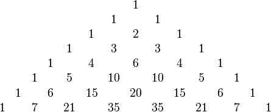

https://www.beecrowd.com.br/judge/en/problems/view/2232

# Pascal's Triangle

Pascal's Triangle (also known as Tartaglia Triangle in some countries), is an
infinite numeric triangle formed by binomial numbers $\binom{n}{k}$, where $n$
represents the row number and $k$ represents the column number (0-indexed).
The triangle was discovered by the chinese mathematician Yang Hui, and 500
years later, many of its properties was studied by Blaise Pascal. Each number
in Pascal's Triangle is equal to the sum of the number immediately above it
and its predecessor.

David, the mastermind of your competitive programming team, found that the sum
of the $i_{th}$ row of the Pascal's Triangle is $2^i$. Now, he wants to find
the sum of the first $N$ rows of the triangle. However, he thinks this problem
is too easy and does not deserve his attention (he decided to try to solve a
problem about bipartite graphs instead, a much harder topic), thus, you are
the one who must solve this problem.

## Input

First line of input contains an integer $T$, the number of test cases. The
next $T$ lines contain a number $N (1 \leq N \leq 31)$, the number of lines in
the Pascal's Triangle you must solve.

## Output

For each test case, the output must contain a line with an integer $S$, the
sum of the first $N$ lines in the Pascal's Triangle.
