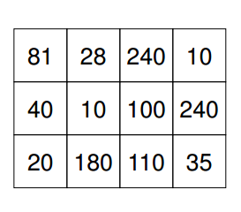

https://judge.beecrowd.com/en/problems/view/2293

# Campo de Minhocas

Minhocas são muito importantes para a agricultura e como insumo para produção de
ração animal. A Organização para Bioengenharia de Minhocas (OBM) é uma entidade
não governamental que promove o aumento da produção, utilização e exportação de
minhocas.

Uma das atividades promovidas pela OBM é a manutenção de uma fazenda
experimental para pesquisa de novas tecnologias de criação de minhocas. Na
fazenda, a área destinada às pesquisas é de formato retangular, dividida em
células quadradas de mesmo tamanho. Em cada célula é criada apenas uma espécie
de minhoca. As células são utilizadas para testar os efeitos, sobre a produção
de minhocas, de variações de espécies de minhoca, de tipos de terra, de adubo,
de umidade, etc. Os pesquisadores da OBM mantêm um acompanhamento constante do
desenvolvimento das minhocas em cada célula, e têm uma estimativa extremamente
precisa da produtividade de cada uma das células.

Um pesquisador da OBM inventou e construiu uma máquina colhedeira de minhocas, e
quer testá-la na fazenda. A máquina tem a largura de uma célula, e em uma
passada pelo terreno de uma célula colhe todas as minhocas dessa célula,
separando-as, limpando-as e empacotando-as. Ou seja, a máquina eliminara uma das
etapas mais intensivas de mão de obra no processo de produção de minhocas. A
máquina, porém, ainda está em desenvolvimento e tem uma restrição: não faz
curvas, podendo movimentar-se somente em linha reta.

Decidiu-se então que seria efetuado um teste com a máquina, de forma a colher o
maior número possível de minhocas em uma unica passada, em linha reta, de lado a
lado do campo de minhocas. Ou seja, a máquina deve colher todas as minhocas de
uma ‘coluna’ ou de uma ‘linha’ de células do campo de minhocas (a linha ou
coluna cuja soma das produtividades esperadas das células é a maior possível).

Escreva um programa que, fornecido o mapa do campo de minhocas, descrevendo a
produtividade estimada em cada célula, calcule o número esperado total de
minhocas a serem colhidas pela máquina durante o teste, conforme descrito acima.

## Entrada

A primeira linha da entrada contém dois números inteiros N e M, representando
respectivamente o número de linhas $(1 \leq N \leq 100)$ e o número de colunas
$(1 \leq M \leq 100)$ de células existentes no campo experimental de minhocas.
Cada uma das N linhas seguintes contém M inteiros, representando as
produtividades estimadas das células correspondentes a uma linha do campo de
minhocas.

A entrada deve ser lida do dispositivo de entrada padrão (normalmente o
teclado).

## Saída

A saída deve ser composta por uma unica linha contendo um inteiro, indicando o
número esperado total de minhocas a serem colhidas pela máquina durante o teste.

A saída deve ser escrita no dispositivo de saída padrão (normalmente a tela).
