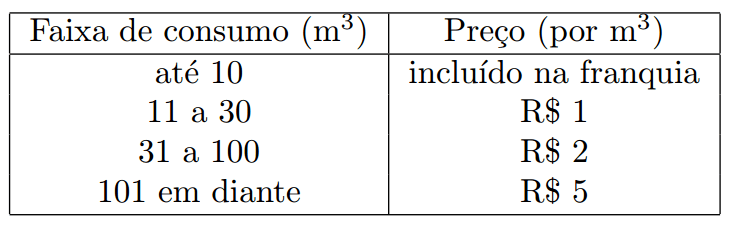

https://judge.beecrowd.com/en/problems/view/2369

# Conta de Água

A empresa local de abastecimento de água, a Saneamento Básico da Cidade (SBC),
está promovendo uma campanha de conservação de água, distribuindo cartilhas e
promovendo ações demonstrando a importância da água para a vida e para o meio
ambiente.

Para incentivar mais ainda a economia de água, a SBC alterou os preços de seu
fornecimento de forma que, proporcionalmente, aqueles clientes que consumirem
menos água paguem menos pelo metro cúbico. Todo cliente paga mensalmente uma
assinatura de R$ 7, que inclui uma franquia de 10 $m^3$ de água. Isto é, para
qualquer consumo entre 0 e 10 $m^3$, o consumidor paga a mesma quantia de R$ 7
reais (note que o valor da assinatura deve ser pago mesmo que o consumidor não
tenha consumido água). Acima de 10 $m^3$ cada metro cúbico subsequente tem um
valor diferente, dependendo da faixa de consumo. A SBC cobra apenas por
quantidades inteiras de metros cúbicos consumidos. A tabela abaixo especifica o
preço por metro cúbico para cada faixa de consumo:

Assim, por exemplo, se o consumo foi de 120 $m^3$ , o valor da conta é:

- 7 reais da assinatura básica;
- 20 reais pelo consumo no intervalo 11 - 30 $m^3$;
- 140 reais pelo consumo no intervalo 31 - 100 $m^3$;
- 100 reais pelo consumo no intervalo 101 - 120 $m^3$.

Logo o valor total da conta de água é R$ 267.

Escreva um programa que, dado o consumo de uma residência em $m^3$, calcula o
valor da conta de água daquela residência.

## Entrada

A única linha da entrada contém um único inteiro $N$, indicando o consumo de
água da residência, em $m^3 (0 \leq N \leq 10^3)$.

## Saída

Seu programa deve imprimir uma única linha, contendo o valor da conta de água
daquela residência.
