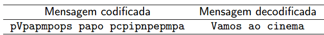

https://judge.beecrowd.com/en/problems/view/2453

# Língua do P

Uma brincadeira que crianças adoram é se comunicar na língua do P, acrescentando
pê antes de cada sílaba, como uma forma de código para dificultar que outras
pessoas entendam a conversa (pê-va pê-mos pê-no pê-ci pê-ne pê-ma?).

Jacy e Kátia adaptaram a língua do P para mensagens eletrônicas, acrescentando a
letra P minúscula ‘p’ antes de cada letra das palavras de uma mensagem. Um
exemplo de mensagem codificada e a respectiva mensagem decodificada é mostrada
na figura abaixo.

Sua tarefa é escrever um programa que decodifique uma mensagem escrita na língua
do P eletrônica de Jacy e Kátia.

## Entrada

A entrada consiste de uma única linha, contendo uma mensagem escrita na língua
do P eletrônica de Jacy e Kátia, a mensagem contém apenas letras maiúsculas e
minúsculas e espaços em branco, a mensagem tem entre 1 e 1000 caracteres, não há
dois espaços em branco consecutivos na mensagem.

## Saída

Seu programa deve produzir uma única linha, contendo a mensagem decodificada.
