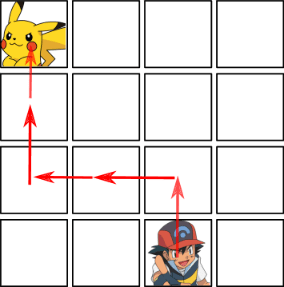

https://judge.beecrowd.com/en/problems/view/2520

# The Last Analógimôn

Analógimôn Go! is a very popular game. During his quest, the player travels
across many cities capturing virtual little monsters called analógimôns. You
just entered a city that contains the very last analógimôn you still don’t have!

The city can be described as a grid with $N$ rows and $M$ columns. You are at a
given position in the city, while the last analógimôn is at another position in
the same city. In one second, you can move (exactly) one position to the north,
to the south, to the west or to the east. Considering that the analógimôn does
not move at all, you task is to determine the minimum amount of time you need to
reach it.

The following figure shows the first sample input, and shows a path that can be
made in 5 seconds. There are other paths that can be used that take the same
amount of time, but there is no path that takes less time than this one.

## Input

The input contains several test cases. The first line of each test case contains
two integers $N$ and $M (2 \leq N, M \leq 100)$, the number of rows and columns,
respectively. Next $N$ lines contains $M$ integers each, describing the city.
Integer 0 indicates an empty position; integer 1 indicates your position; and
integer 2 indicates the analógimôn’s position. It is guaranteed that there is
exactly one integer 1 and exactly one integer 2 in the test case, and that all
other integers are equal to 0.

The input ends with end-of-file (EOF).

## Output

For each test case, print a line containing the minimum time needed to reach the
last _analógimôn_, in seconds.
