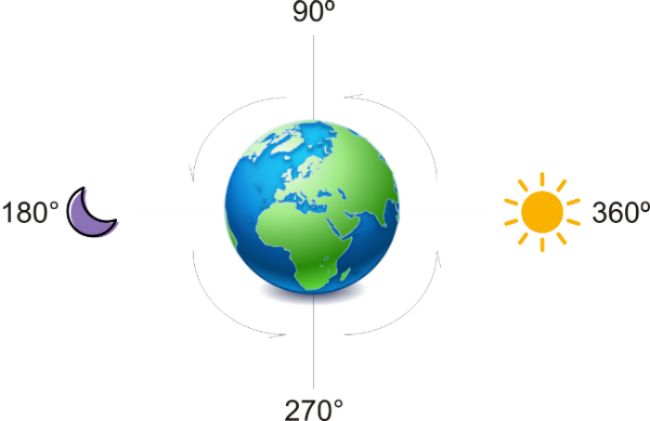

https://judge.beecrowd.com/en/problems/view/2685

# The Change

Julio is creating a new SmartWatch, especially for programmers. It's amazing the
advantages he offers and the comfort that he has to code. The clock still been
in development and he promised to fix the bugs and put some better gear and, in
return, he asked for a simple system for Stand Bay mode. The problem is the
clock itself always has the inclination angle of the Sun/Moon (0 to 360). Given
a clock, your mission is, if you want to accept: given in degrees the
inclination of the Sun/Moon in relation to the Earth, tell what period of the
day it is.

## Input

The input contains an integer $M (0 \leq M \leq 360)$ representing the degree of
the Sun/Moon. As the position changes constantly, your program will receive
several cases every second (EOF).

## Output

Print a greeting for the time of day it is: "Boa Tarde!!"(Good Afternoon!!),
"Boa Noite!!"(Good Night!!), "Bom Dia!!"(Good Morning) and "De
Madrugada!!"(Dawn!!).
