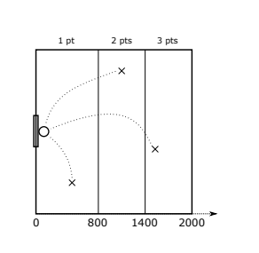

https://www.beecrowd.com.br/judge/en/problems/view/2780

# Robot Basketball

The OIBR organization, the International Robot Basketball Olympiad, is
starting to have problems with two teams: the Bit Warriors and the Byte Bulls.
It's just that the robots on these teams hit almost every pitch from any
position on the court! Come to think of it, the basketball game would be
awkward if players could hit any pitch, right? One of the measures that the
OIBR is implementing is a new score for the launches, according to the
distance from the robot to the beginning of the court. The court is 2000
centimeters long, as in figure.

Given the distance D of the robot to the beginning of the court, where the
basket is, the rule is as follows:

- If $D \leq 800$, the basket is worth 1 point;
- If $800 \lt D \leq 1400$, the basket is worth 2 points;
- If $1400 \lt D \leq 2000$, the basket is worth 3 points. The OIBR organization
  needs help to automate the game's scoreboard. Given the value of distance D,
  you must write a program to calculate the number of launch points.

## Input

The first and only line of the input contains an integer $D (0 \leq D \leq
2000)$ indicating the distance of the robots to the start of the block, in
centimeters, at launch.

## Output

Your program should produce a single line, containing an integer, 1, 2, or 3,
indicating the launch season.
