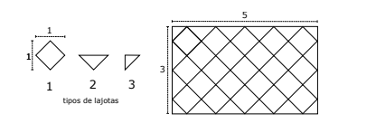

https://www.beecrowd.com.br/judge/en/problems/view/2786

# School Floor

The school intends to change the floor of a classroom and the principal took
the opportunity to pass on a task to the students. The room has the shape of a
rectangle of width L meters and length C meters, where L and C are integers.
The principal needs to buy ceramic tiles to cover the entire floor of the
room. It would be easy to calculate how many tiles would be needed if each
tile were a 1 meter square. The problem is that the small flagstone that the
director wants to buy is a square that is 1 meter diagonal, not sideways. In
addition, she wants to fill the floor of the room with the diagonals of the
tiles lined up at the sides of the room, as in the figure.

The store will supply tiles of type 1: whole; of type 2, which are of the half
of type 1, cut along the diagonal; and type 3 slabs, which correspond to the
half of type 2. See the three types of slabs in the figure.

It is very clear that 4 type 3 tiles are always needed for the corners of the
room. The assignment that a principal passed to the students is the number of
types 1 and 2 awards that are needed. In the figure, for L = 3 and C = 5, 23
of type 1 and 12 of type 2 were required. His program needs to compute, given
the values ​​of L and C, the quantity of type 1 and type 2 tiles.

## Input

The first initial line contains an integer $L (1 \leq L \leq 100)$ indicating
the width of the room. A second line contains an integer $C (1 \leq C \leq
100)$ representing the length of the room.

## Output

Print two lines on the output. The first must contain an integer, representing
the number of tiles of type 1 required. The second must contain an integer,
indicating the number of tiles of type 2.
