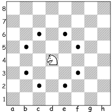

https://judge.beecrowd.com/en/problems/view/2808

# Knights Again

Given the initial position of a Knight on a chessboard and the target position,
it must be said if, with exactly one movement, the Knight can reach the target
position. If this is possible, the move is classified as valid, otherwise the
move is said invalid..

On a chessboard numbers are used, from 1 to 8, to specify the board line and
letters, from 'a' to 'h,' to specify the column.

## Input

The entry consists of a single line containing the initial position of the
Knight and the target position, separated by a space. A position in the board is
specified by a character, which represents the column, followed by an integer
representing the line.

## Output

The output consists of a line containing the message "VALIDO" if the move is a
valid movement of a Knight in the game of chess or "INVALIDO" otherwise.
