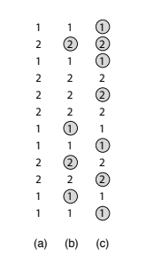

https://judge.beecrowd.com/en/problems/view/3048

# Sequência Secreta

Na calçada em frente ao Palácio Imperial, não se sabe a razão, existe uma
sequência de $N$ números desenhados no chão. A sequência tem a seguinte forma:
ela começa e termina com o número $1$; apenas os números $1$ e $2$ aparecem
nela; e o número $2$ aparece pelo menos uma vez. Veja um exemplo na coluna (a)
da figura ao lado. Ninguém sabe o significado da sequência e, justamente por
isso, várias teorias malucas surgiram. Uma delas diz que a sequência representa,
na verdade, apenas um valor que estaria relacionado a um segredo dos
imperadores. Esse valor é a quantidade máxima de números da sequência que
poderiam ser marcados com um círculo, de modo que a sequência de números
marcados não contenha dois números iguais consecutivos. A coluna (b) da figura
ao lado ilustra uma sequência de $4$ números marcados que obedece a restrição
acima. Só que é possível marcar $7$ números, como mostra a coluna (c) da figura.

Neste problema, dada a sequência original de números desenhados no chão da
calçada, seu programa deve computar e imprimir a quantidade máxima de números da
sequência que poderiam ser marcados com um círculo sem que haja dois números
iguais consecutivos na sequência marcada.

## Entrada

A primeira linha da entrada contém um inteiro $N$ representando o tamanho da
sequência. As $N$ linhas seguintes contêm, cada uma, um inteiro $V_i$ , para $1
\leq i \leq N$, definindo a sequência de números desenhados no chão da calçada
imperial.

## Saída

Seu programa deve imprimir uma linha contendo um número inteiro representando a
quantidade máxima de números da sequência que poderiam ser marcados com um
círculo sem que haja dois números iguais consecutivos na sequência marcada.

### Restrições

- $3 \leq N \leq 500$

- $V_i$ é igual a $1$ ou $2$, para $1 \leq i \leq N$
