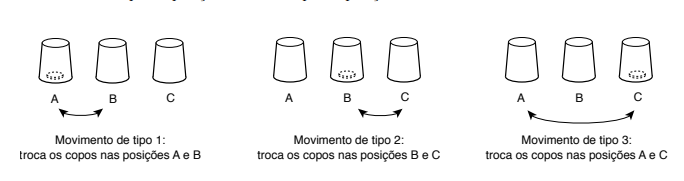

https://judge.beecrowd.com/en/problems/view/3053

# Jogo Dos Copos

Uma brincadeira muito comum e divertida entre dois jogadores usa uma moeda e
três copos opacos (ou seja, não é possível ver o que está dentro do copo olhando
pela lateral do copo). Os três copos são colocados com a boca para baixo, em uma
linha, um ao lado do outro, em posições que vamos chamar de A, B e C. Uma moeda
é colocada embaixo de um dos copos. Na brincadeira, um jogador chamado banca
realiza um movimento para trocar a posição de dois copos, arrastando os copos de
tal modo que se a moeda está em baixo de um dos copos envolvidos no movimento,
ela continua embaixo do mesmo copo após a troca de posição. O jogador banca pode
realizar três tipos de movimento, ilustrados na figura abaixo:

1. Trocar o copo na posição A com o copo na posição B.
1. Trocar o copo na posição B com o copo na posição C.
1. Trocar o copo na posição A com o copo na posição C.

O jogador banca realiza vários movimentos de troca tentando confundir o outro
jogador, chamado espectador. Ao final o jogador espectador deve dizer em qual
posição está a moeda. Por exemplo, considere que inicialmente a moeda está
embaixo do copo na posição A e que o jogador banca realiza uma sequência de
apenas três trocas, executando um movimento do tipo 1, após o qual moeda termina
embaixo do copo na posição B, seguido de um movimento do tipo 2, após o qual a
moeda termina embaixo do copo na posição C, seguido de um movimento do tipo 3,
após o qual a moeda termina embaixo do copo na posição A.

Nesta tarefa, dadas a descrição da sequência de movimentos e a posição inicial
da moeda, você deve escrever um programa que determine a posição final da moeda
após todos os movimentos.

## Entrada

A primeira linha contém um inteiro $N$, o número de movimentos que o jogador
banca realiza. A segunda linha contém um caractere, entre A, B e C, indicando a
posição inicial da moeda. Cada uma das $N$ linhas seguintes contém um inteiro,
indicando o tipo de movimento efetuado pelo jogador banca na sequência.

## Saída

Seu programa deve produzir uma única linha, com um único caractere entre A, B e
C, a posição em que a moeda se encontra ao final da sequência de movimentos.

Restrições • $1 \leq N \leq 1000$
