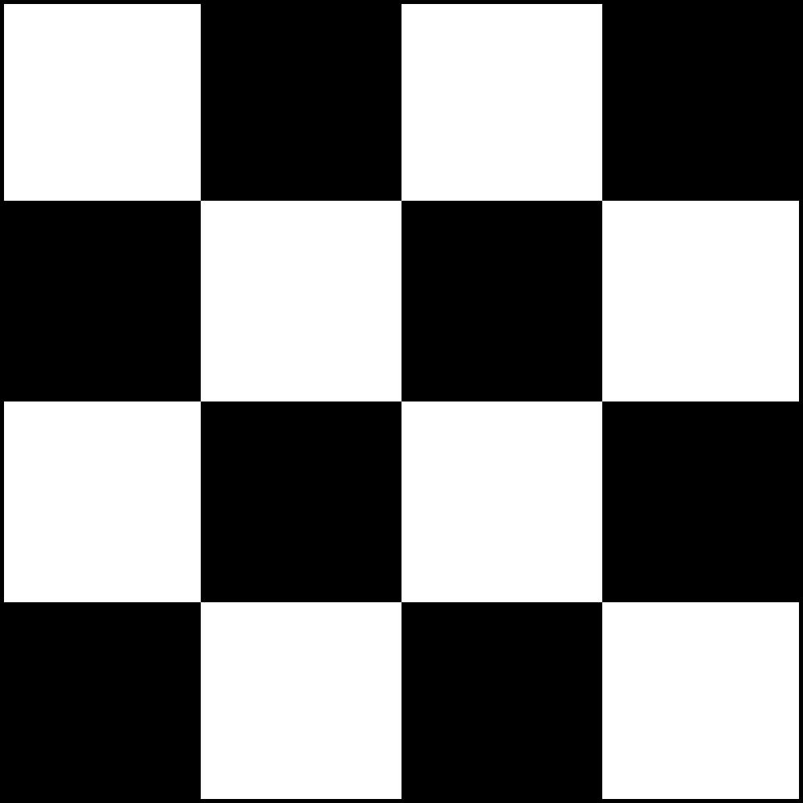

https://judge.beecrowd.com/en/problems/view/3342

# Keanu

Keanu was testing new chessboard models when he had the following doubt:

How many white squares and many black squares does an nxn-sized chessboard have?

3x3-sized chessboard:

5 white squares and 4 black squares

4x4-sized chessboard:

8 white squares and 8 black squares

Note that the topmost and leftmost square is always white.

## Input

The input consists of a line with a single integer n.

$2 \leq n \leq 100$

## Output

Print "a white squares and b black squares" without quotes, where a is the number of white squares and b the number of black squares.
