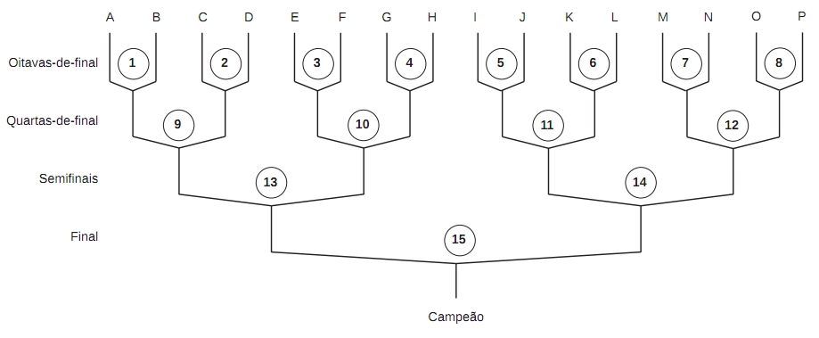

http://br.spoj.com/problems/COPA1/

# Copa do mundo

Este ano tem Copa do Mundo! O país inteiro se prepara para
torcer para a equipe canarinho conquistar mais um título,
tornando-se hexacampeã.

Na Copa do Mundo, depois de uma fase de grupos, dezesseis
equipes disputam a Fase final, composta de quinze jogos
eliminatórios. A figura abaixo mostra a tabela de jogos da
Fase final:



Na tabela de jogos, as dezesseis equipes finalistas são
representadas por letras maiúsculas (de A a P), e os jogos são
numerados de 1 a 15. Por exemplo, o jogo 3 é entre as equipes
identificadas por E e F; o vencedor desse jogo enfrentará o
vencedor do jogo 4, e o perdedor será eliminado. A equipe que
vencer os quatro jogos da Fase final será a campeã (por exemplo,
para a equipe K ser campeã ela deve vencer os jogos 6, 11, 14 e 15.

## Tarefa

Dados os resultados dos quinze jogos da Fase final, escreva um
programa que determine a equipe campeã.

## Entrada

A entrada é composta de quinze linhas, cada uma contendo o
resultado de um jogo. A primeira linha contém o resultado do
jogo de número 1, a segunda linha o resultado do jogo de número
2, e assim por diante. O resultado de um jogo é representado
por dois números inteiros M e N separados por um espaço em
branco, indicando respectivamente o número de gols da equipe
representada à esquerda e à direita na tabela de jogos
($0 \leq M \leq 20$, $0 \leq N \leq 20$ e $M \neq N$).

## Saída

Seu programa deve imprimir uma única linha, contendo a letra
identificadora da equipe campeã.

## Exemplo

### Entrada

```
4 1
1 0
0 4
3 1
2 3
1 2
2 0
0 2
1 2
4 3
0 1
3 2
3 4
1 4
1 0
```

### Saída

```
F
```

### Entrada

```
2 0
1 0
2 1
1 0
1 0
1 2
1 2
1 0
2 1
1 0
0 1
0 2
2 1
1 0
2 1
```

### Saída

```
A
```
