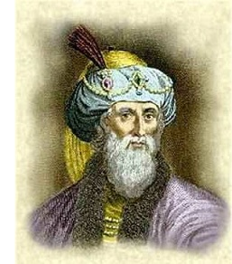
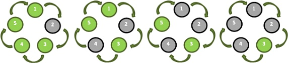

http://www.urionlinejudge.com.br/judge/en/problems/view/1030

# Flavious Josephus Legend

The Josephus problem is this way known because of the Flavius Josephus
legend, a Jewish historian living in the 1st century. According to
Josephus' account of the siege of Yodfat, he and his 40 comrade soldiers
were trapped in a cave, the exit of which was blocked by Romans. They
chose suicide over capture and decided that they would form a circle and
start killing themselves using a step of three. Josephus states that by
luck or maybe by the hand of God, he remained the last and gave up to the
Romans.”

## Input

There are $NC (1 \leq NC \leq 30 )$ test cases. In each input test case
there will be a pair of positive integer numbers
$n (1 \leq n \leq 10000)$ and $k (1 \leq k \leq 1000)$. The number $n$
represent the quantity of people in the circle, numbered from 1 to
$n$. The number k represents the size of step between two men in the circle.

Follow an example with 5 men and step 2: In this example the remaining
element is 3.

The data must be read from standard input.

## Output

For each test case we will have a line of output, presenting the in the
following format: Case $n$: $m$ always with a space before $n$ and $m$.
