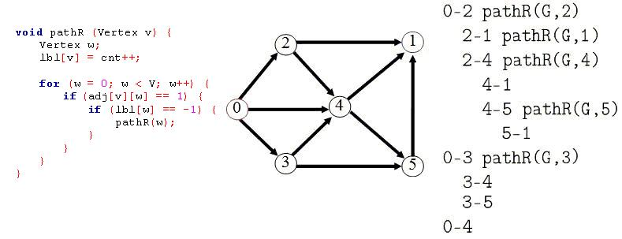

https://www.beecrowd.com.br/judge/en/problems/view/1081

# DFSr - Depth Hierarchy

In graphs, the PathR function is well-known. It's called dfs or dfsr. It means
a recursive deph-searching in nodes of a graph, using backtracking. The task
here is, from a input graph, generate the hierarquie desing of the searched
nodes. To help you, is given the PathR procedure, listed above.



## Input

The input file contains many test cases. The first line of the input file
contains an integer N  that represents the quantity of test cases that follows.
Each one of N test cases contains, in the first line, two informations:
$(1 \leq V \leq 20)$ and $E (1 \leq E \leq 20)$, that are respectively the amount of vertices and edges of the graph. Follow E lines containing informations over
all of the edges of this graph.

## Output

For each test case, an output must be printed that represents a depth search
for all nodes, with respect of the hierarquie of each of them. The character b
means a blank space. See the follewing example:

```
bb0-2 pathR(G,2)
bbbb2-1 pathR(G,1)
bbbb2-4 pathR(G,4)
bbbbbb4-1
```

And so on...
Obs.: The program should print a blank line after each test case, even after
the last test case.
