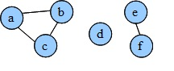

https://www.beecrowd.com.br/judge/en/problems/view/1082

# Connected Components

Based on these three definitions:

Connected graph: A graph $G (V, E)$ is connected if for each pair of nodes u
and v there is a path between u and v. A graph with only one component is a
connected graph.

Disconnected graph: A graph $G (V, E)$ is disconnected if it is formed by two
or more connected components.

Connected component: Connected components of a graph are connected subgraphs of
this graph.

The following graph has 3 connected components. The first one is formed by
nodes $a$, $b$, $c$. The second one is formed only by $d$ node and the third
component is formed by nodes e and f.

Based on these concepts, where each input has identification of each one of the
vertices, edges and the links between the nodes by the edges, list all
connected components that exist in the graph, according to the given input.

## Input

The first line of input file contains an integer $N$ that represents the number
of test cases that follows. Each test case contains two numbers $V$ and $E$,
respectively the number of Vertices and Edges of the graph. Follow E lines,
each one representing one of the edges that connect such vertex. Each vertex is
represented by a lowercase letter of the alphabet. This mean 26 vertex at
maximum (a-z). Each graph has at least one connected component.

Obs: The vertex of each test case always begin with 'a'. This mean that a test
case with 3 vertex has the vertex 'a', 'b' and 'c'.

## Output

For each test case, print the message Case #n: indicating the number of test
case (as shown below). Follow the vertex of each segment, a segment per line,
separated by commas (including a comma at the end of the line). Finishing the
test case a message must be printed indicating the number of connected
components of the graph. Every test case must have a blank line printed at the
end, including the last one.

Important: the vertices must be printed in ascending order and if exist path
from a to b means that exist path from b to a.
