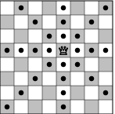

http://www.urionlinejudge.com.br/judge/problems/view/1087

# Queen

The game of Chess has several pieces with curious movements. One of them is
the Queen, which can move any number of squares in any direction: in the
same line, in the same column or in any of the diagonals, as illustrated by
the figure below (black dots represent positions the queen may reach in one
move):

The great Chess Master Kary Gasparov invented a new type of chess problem:
given the position of a queen in an empty standard chess board (that is,
an 8 x 8 board) how many moves are needed so that she reaches another given
square in the board?

Kary found the solution for some of those problems, but is having a difficult time to solve some others, and therefore he has asked that you write a
program to solve this type of problem.

## Input

The input contains several test cases. The only line of each test case
contains four integers $X_1$, $Y_1$, $X_2$ and
$Y2 (1 \leq X1, Y1, X2, Y2 \leq 8)$. The queen starts in the square with
coordinates ($X+1$, $Y_1$), and must finish at the square with coordinates ($X_2$,
$Y_2$). In the chessboard, columns are numbered from 1 to 8, from left ro
right; lines are also numbered from 1 to 8, from top to bottom. The
coordinates of a square in line X and column $Y$ are ($X$, $Y$).

The end of input is indicated by a line containing four zeros,
separated by spaces.

## Output

For each test case in the input your program must print a single line,
containing an integer, indicating the smallest number of moves needed
for the queen to reach the new position.
