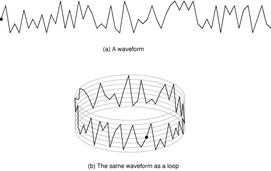

http://www.urionlinejudge.com.br/judge/en/problems/view/1089

# Musical Loop

A musical loop is a small section of music composed to be played
continuously (that is, the section is played again when it reaches
the end), in a seamless way. Loops are used in many styles of popular
music (hip hop, techno, etc), as well in computer games, especially
casual games on the Internet.

Loops may be digitalized for example using PCM (Pulse Code Modulation),
a technique for representing analog signals used extensively in digital
audio. In PCM, the magnitude of the signal is sampled at regular intervals,
and the values sampled are stored in sequence. To produce the sound for the
sampled data, the procedure is applied in reverse (demodulation).

Fernanda works for a game software house, and composed a beautiful musical
loop, coded in PCM. Analyzing the waveform of her loop in audio editing
software, Fernanda became curious when she noticed the number of "peaks".
A peak in a waveform is the value of a sample that represents a local
maximum or minimum. The figure below illustrates (a) a waveform and
(b) the loop formed with this waveform, containing 48 peaks.

Fernandinha is a dear friend of yours. She has asked your help to determine
how many peaks exist in her musical loop.

## Input

The input contains several test cases. The first line of a test case
contains one integer $N$, representing the number of samples in the musical
loop composed by Fernanda $(2 \leq N \leq 10^4)$. The second line contains
$N$ integers $H_i$, separated by spaces, representing the sequence of
magnitudes sampled ($-10^4 \leq Hi \leq 10^4 for \space 1 \leq i \leq N$,
$H_1 \neq H_N$ and $H_i \neq H_{i + 1}$ for $1 \leq i \lt N)$. Notice that
$H_1$ follows $H_N$ when the loop is played.

The end of the input is indicated by a line that contains only one zero.

## Output

For each test case in the input your program must print a single line,
containing one integer, the number of peaks that exist in the musical loop.
