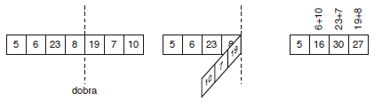
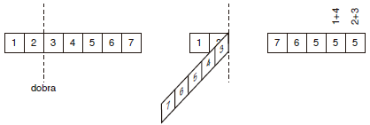

https://www.beecrowd.com.br/judge/en/problems/view/1470

# Folding Machine

One of the main tools of a Turing machine, which allows its computing power to
be bigger than other simpler models, is an infinite tape, divided in cells,
where information is stored.

A Folding machine is a machine inspired by a Turing machine. In a Folding
machine, the tape is finite, the data are integers and instead of having the
functionality of the original Turing machine, this machine uses folding tape
operations.

To perform a folding operation, the machine chooses a position between
adjacent cells and folds the tape, adding the values of overlapping cells, as
can seen in the figure below.

Notice that the machine can also fold the tape before the tape center, as
shown in the next figure. The machine can also choose to fold at the tape
start or at the tape end, actually inverting the tape.

Science of Bends Company is developing commercial versions of their Folding
machine and its production have recently raised. The last lot produced,
unfortunately, have some issues and some machines aren’t working properly.
Some additional testing is therefore needed, to avoid selling defective
machines, which would denigrate the company’s image.

To test these machines, a set of tests and tapes are given. For each tape, the
machine returns some computation result. Therefore, the engineers responsible
for testing take note of the results and can verify if they are correct. But
these engineers forgot to take note of which computation was made in each test
case. To avoid re-testing all machines again, the engineers agreed that any
combination of foldings is sound and accepted if, from a given input, it
generates the expected output. You were hired to develop a program which,
given the input and output tapes, determines whether there is a folding
sequence that, starting from the input tape, generates the output tape. Input
The input contains several.

## Input

The input contains several test cases and ends with EOF. Each test case is
composed of four lines. The first two lines refer to the input tape for the
Folding machine and the last two lines refer to the output tape. The first
line contains a single number, $N$ ($M \leq N \leq 15$), describing the input
tape size. The second line contains N integers v1, . . . , vN, describing the
content of the input tape. The third line contains a single integer $M$
($1 \leq M \leq N$), the output tape size; and the fourth line contains M
integers w1, . . . ,wM, the content of the output tape.

Note: $0 \leq v_i$, $w_j \leq 10^8 for \space 1 \leq _i \leq N$ and
$1 \leq _j \leq M$.

## Output

For each test case your program must produce a single line, containing a
single character, which must be “S” if there is a folding sequence able to
generate the output tape starting from the input tape, and “N” otherwise.
