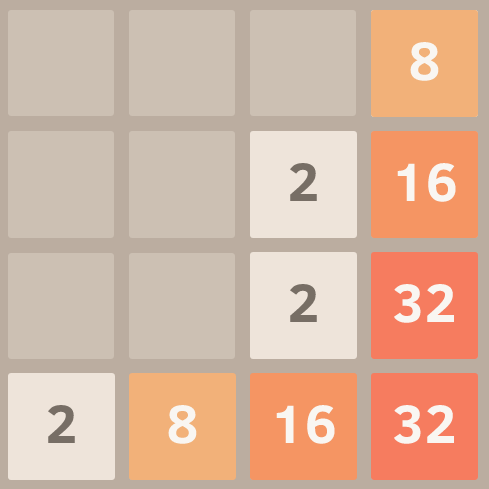

https://www.urionlinejudge.com.br/judge/en/problems/view/1559

# 2048

This year, the game known as 2048 has become very popular on the internet.
Here is a screenshot of the game:

The arrow keys are used to perform moves (up, down, left and right). Every
time a key is pressed, the numbered blocks try to slide in the matrix if there
is space. In the example image, if the left key is pressed, 5 blocks will move
(8, 2, 16, 2, 32).

Besides of trying to slide, adjacent blocks with the same number come together
in a single block with a doubled number if they try to slide in the right
direction. In the example image, if the down key is pressed, two blocks 2 will
turn into a block 4 and two blocks 32 will turn into a block 64.

During the game, in addition to the plays, blocks containing powers of 2
appear randomly in the matrix. The goal is to join the blocks to form a block
with the number 2048. When this happens, the player wins the game and cannot
make any more moves.

However, it can also happen that the player is left without possible moves
before forming the number 2048. In the example image, press the right key is
not a legal move, since no block can move or join another block.

Your task in this problem is to say which moves is valid for a given state of
the game.

## Input

The input starts with a line containing the number of test cases. For each
test case, the input consists of 4 lines containing a square array of size 4.
Matrix numbers are equal to 0 to indicate that no block is in the position, or
are equal to powers of 2 between 2 and 2048 inclusive.

## Output

For each test, the output consists of one line containing all possible moves
for the given state of the game. The moves are indicated by DOWN, LEFT, RIGHT
and UP. The moves should be written in alphabetical order. If there is no
possible move, print NONE.
