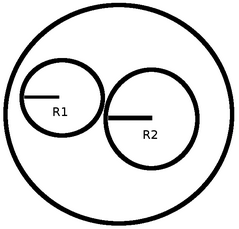

https://urionlinejudge.com.br/judge/en/problems/view/1589

# Bob Conduit

You have got two circular energy cables. The first one has radius R1 and the
second R2. You need to buy a circular conduit (see the image below) that fits
those two cables:

What is the smallest radius of a conduit you need to buy? In other words,
given two circles, what is the smallest radius of a third circle that
circumscribe the other two?

## Input

In the first line there is an integer T (T = 10000), indicating the number of
test cases.

On the only line of each test case we will have the two integers R1 and R2
indicating the cables radius. The integers will be positive and all the math
will fit in a regular integer of 32 bits.

## Output

In each test case, output the answer in a single line.
