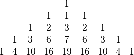

https://www.urionlinejudge.com.br/judge/en/problems/view/1795

# Trinomial Triangle

The trinomial triangle is a number triangle of trinomial coefficients. It can
be obtained by starting with a row containing a single "1" and the next row
containing three 1s and then letting subsequent row elements be computed by
summing the elements above to the left, directly above, and above to the right:

The first row of the trinomial triangle is numbered as zero, the second row is
numbered as one and so on.

Given the row number R, you are asked to write a program that prints the sum
of its elements. For instance, the sum of elements at row 2 is 9 = 1 + 2 + 3 +
2 + 1.

## Input

The input is the row number $R$ ($0 \leq R \leq 20$).

## Output

The output is the sum of all elements at row R. Don't forget the end-of-line
character after printing the sum.
