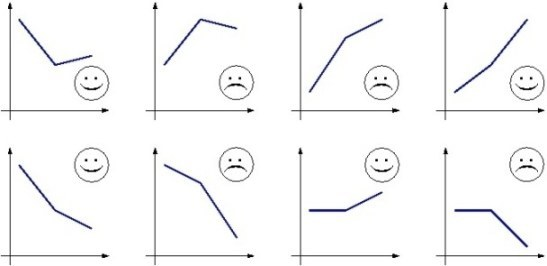

https://www.urionlinejudge.com.br/judge/en/problems/view/1847

# Welcome to the Winter!

Welcome to the Erechim Winter School of the ICPC Brazilian Subregional
Contest! We sincerely hope you learn a lot during these days so you can be
very successful in the Programming contests yet to come, but above all we hope
you enjoy the School, for when we have fun and enjoy ourselves studying and
programming, the training stops being a burden and becomes a hobby. So, have
fun!

The winter is a wonderful season, is it not? We all love wearing a poncho,
joining a chimarrão circle, baking pinhões in a wooden burning stove… But not
everyone likes the winter, especially in places where winter uses to be very
cruel. In Westeros, for example, the people's humour is defined according to
climate tendencies. Based on the temperatures of the last three days, the
people can be sad or happy, being more likely to make war or to make love,
respectively. And, let us be honest, it is precisely because of the scenes of
love and war that we love Game of Thrones!

- If the temperature decreased from the 1st to the 2nd day, but increased or
  remained constant from the 2nd to the 3rd, the people are happy (first
  figure).
- If the temperature increased from the 1st to the 2nd day, but decreased or
  remained constant from the 2nd to the 3rd, the people are sad (second
  figure).
- If the temperature increased from the 1st to the 2nd day and from the 2nd to
  the 3rd, but increased from the 2nd to the 3rd less than what had increased
  from the 1st to the 2nd, the people are sad (third figure).
- If the temperature increased from the 1st to the 2nd day and from the 2nd to
  the 3rd, but increased from the 2nd to the 3rd at least what had increased
  from the 1st to the 2nd, the people are happy (fourth figure).
- If the temperature decreased from the 1st to the 2nd day and from the 2nd to
  the 3rd, but decreased from the 2nd to the 3rd less than what had decreased
  from the 1st to the 2nd, the people are happy (fifth figure).
- If the temperature decreased from the 1st to the 2nd day and from the 2nd to
  the 3rd, but decreased from the 2nd to the 3rd at least what had decreased
  from the 1st to the 2nd, the people are sad (sixth figure).
- If the temperature remained constant from the 1st to the 2nd day, the people
  are happy if the temperature increased from the 2nd to the 3rd or sad
  otherwise (respectively, seventh and eighth figures).

## Input

The input consists only of three integers, $A$, $B$ and $C$
($-100 \leq A, B, C \leq 100$), which represent respectively the temperatures
recorded in the 1st, in the 2nd and in the 3rd day.

## Output

Print a line containing a happy or a sad smiley, representing how is the
humour of the people of Westeros according to the climate tendencies.

