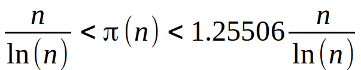

https://www.urionlinejudge.com.br/judge/en/problems/view/2159

# Approximate Number of Primes

Schoenfeld and Rosser published a paper in 1962 describing a minimum and a
maximum value to the quantity of prime numbers up to n, for $n \geq 17$. This
quantity is represented by the function $(n)$ and the inequality is shown
below.

Your task is, given a natural number n, to compute the interval's minimum and
maximum values to the approximate number of primes up to n.

## Input

The input is a natural number $n$ ($17 \leq n \leq 10^9$).

## Output

The output is given as two values $P$ and $M$ with 1 decimal place each, such
that $P < (n) < M$ according to the given inequality above. These two values
have one blank space between them.
