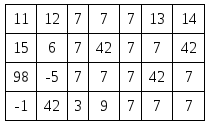

https://www.urionlinejudge.com.br/judge/en/problems/view/2163

# The Force Awakens

A long time ago, in a galaxy far, far away...

After the decline of the Empire, scavengers are spread around the universe
looking for a lost lightsaber. Everyone knows that a lightsaber emits an
unique wave pattern: 42 surrounded by 7 all around. You have a wave sensor
that scans a terrain with N x M cells. Look at the example below for an 4 x 7
terrain with a lightsaber in it (at position (2,4)).

You must write a program that, given an $N \times M$ terrain, looks for the
lightsaber pattern in it. No scan have more than one lightsaber pattern.

## Input

The first line of the input has two positive integers $N$ and $M$,
representing respectively the number of rows and the number of columns scanned
in a terrain ($3 \leq N, M \leq 1000$). Each of the next $N$ lines have $M$
integers, describing the values scanned in each cell of the terrain
($-100 \leq Tij \leq 100, for 1 \leq i \leq N$ and $1 \leq j \leq M$).

## Output

The output is a single line with 2 integers $X$ and $Y$ separated by one
space. They represent the ($X$, $Y$)-coordinate of the lightsaber, if it is
found. If the terrain doesn't have a lightsaber pattern, $X$ and $Y$ are both
zero.
