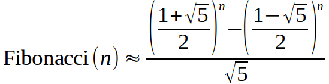

https://www.beecrowd.com.br/judge/en/problems/view/2164

# Fast Fibonacci

Binet's formula is a way to calculate Fibonacci numbers.

Your task is, given a natural number n, to compute the value of Fibonacci(n)
using the formula above.

## Input

The input is a natural number $n$ ($0 < n \leq 50$).

## Output

The output is the value of Fibonacci(n) with 1 decimal place using the given
Binet's formula.
